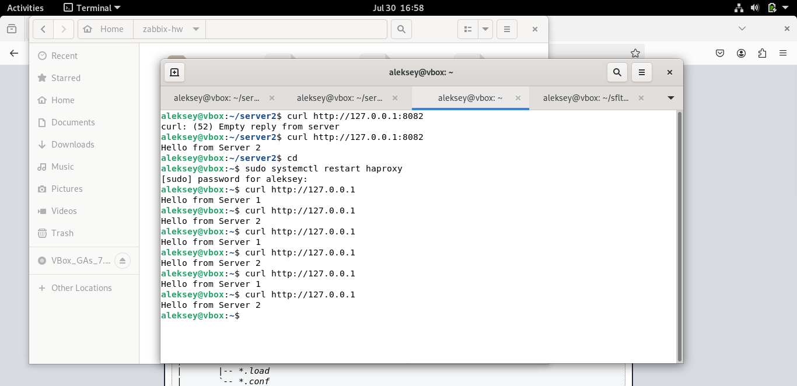
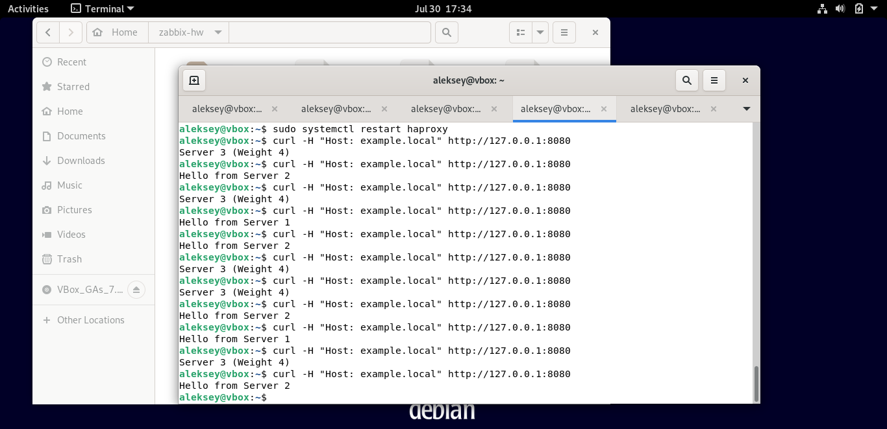

#Домашнее задание к занятию "Название занятия" - Андреев Алексей  
**Задание 1**  

### 1. Запуск двух Python-серверов

```bash
# Сервер 1
mkdir -p ~/server1 && echo "Hello from Server 1" > ~/server1/index.html
cd ~/server1
python3 -m http.server 8081 &

# Сервер 2
mkdir -p ~/server2 && echo "Hello from Server 2" > ~/server2/index.html
cd ~/server2
python3 -m http.server 8082 &
```
[Конфиг HAProxy для задания 1](haproxy1.cfg)



### 2. Запуск трех Python-серверов

[Конфиг HAProxy для задания 2](haproxy2.cfg)





